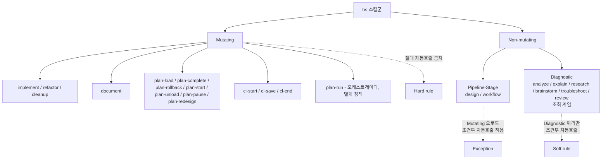
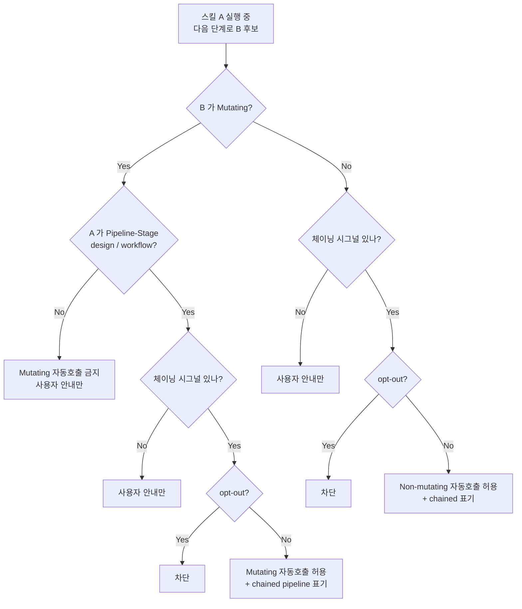
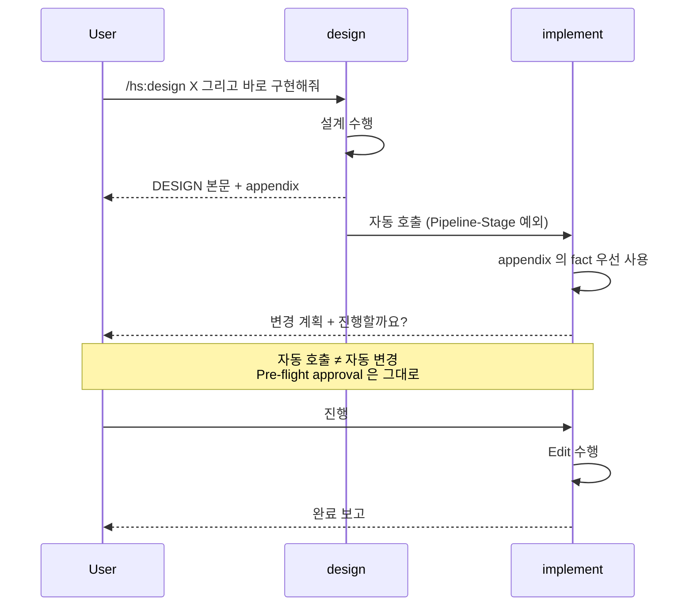
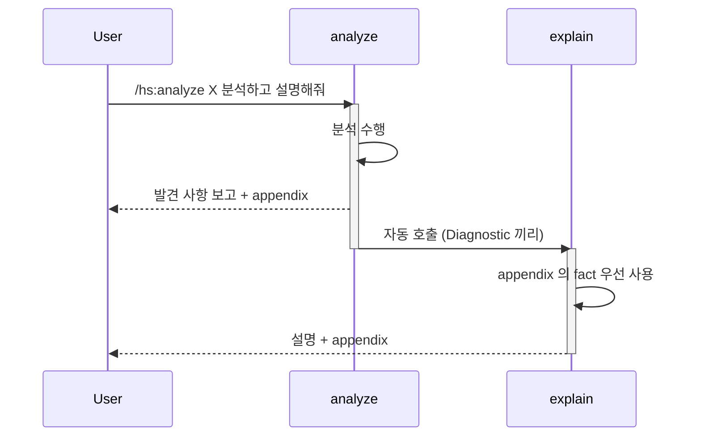
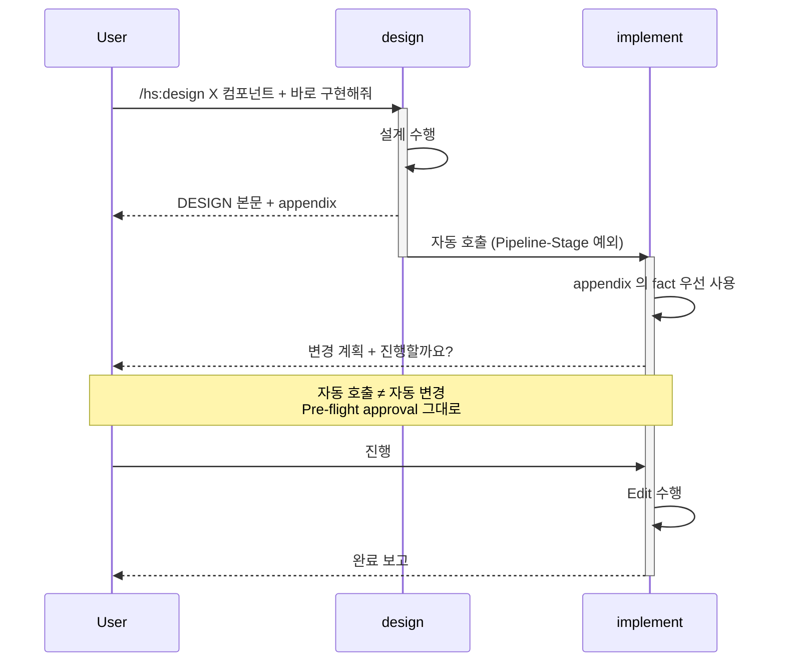
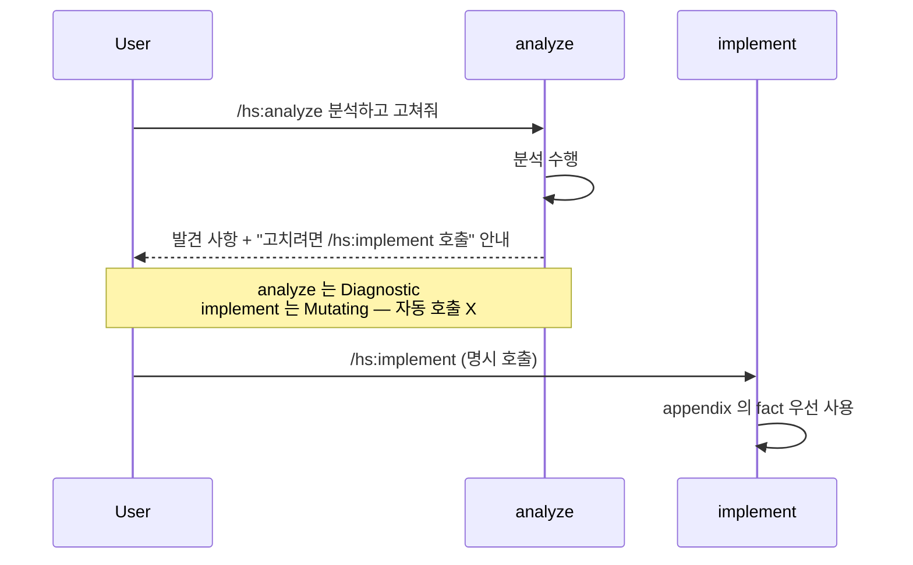
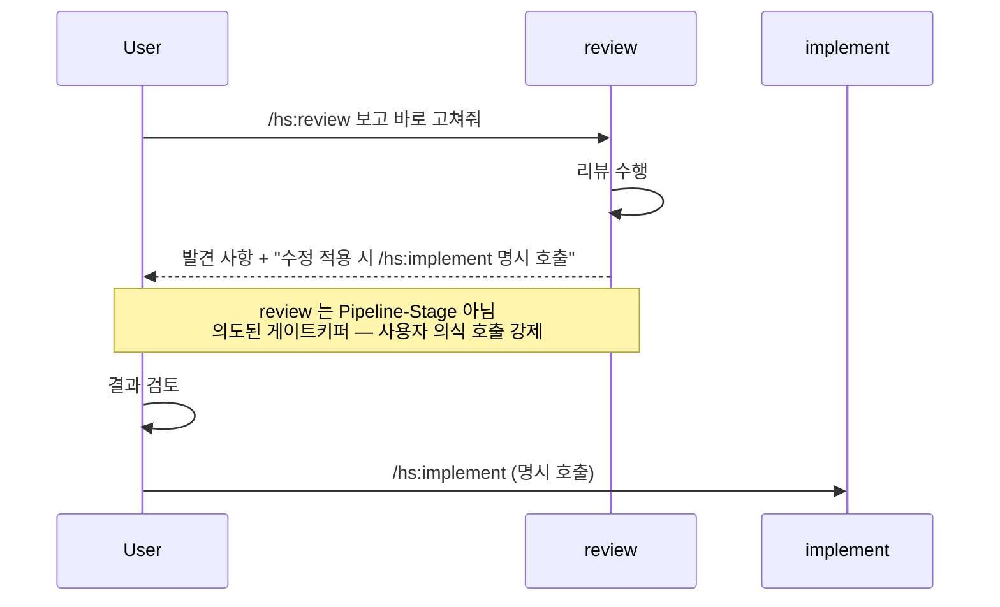
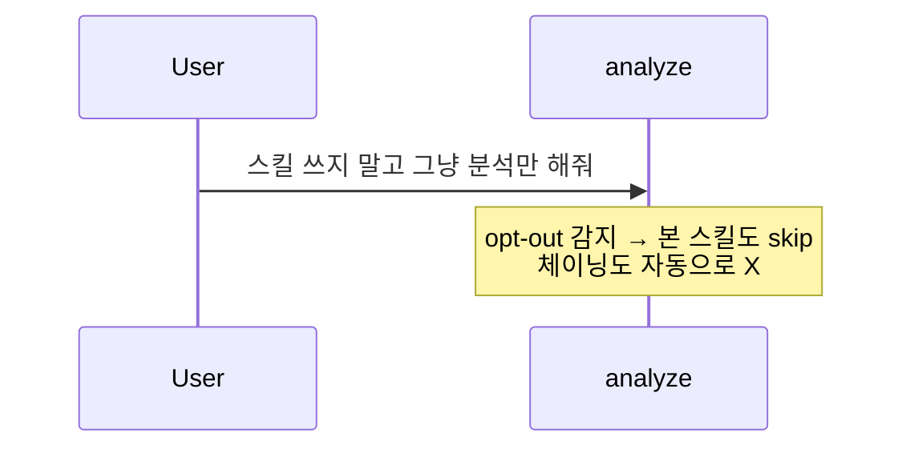

# hs 스킬 정책 완화 + Fact 공유 설계

## 개요
- 목적: hs 스킬군의 일관 정책 "스킬 간 자동 호출 금지" 가 깎고 있는 재사용성을 회복하되, mutating 안전성은 보전. 부가적으로 중복 수집 비용 (Read / find_symbol 재실행) 도 줄임.
- 참조: 세션 내 brainstorm + explain + review 의 Q1/Q2 확정
- 범위:
  - IN — 정책 분기 기준, Output 규약 변경, 모든 hs SKILL.md 의 `Will Not` 항목 / Output policy 절 수정
  - OUT — 자동호출 트리거 학습 / 추론 (LLM 자연 판단에 위임), scratchpad 파일 시스템, harness-level 도구 캐싱

## 제약 / 가정
- 제약:
  - 글로벌 룰 "파일 생성/수정/삭제는 명시 요구 후" 절대 보전
  - 사용자 통제권 / 추적성 절대 보전
  - plan-run 의 사전 일괄 승인 모델과 충돌 없을 것
  - SKILL.md 만 수정. 코드 / 인프라 신설 X
- 가정:
  - 사용자가 "분석하고 정리해줘", "리서치 후 설명", "그대로 구현해" 같은 체이닝 시그널을 자연어로 명확히 줌
  - LLM 이 mutating / non-mutating / Pipeline-Stage 구분을 분류표 보고 정확히 적용 가능

## 아키텍처

### 스킬 분류 (Two-tier + Pipeline-Stage 예외)



| 분류 | 자동호출 정책 | 사유 |
|---|---|---|
| **Mutating** | **절대 금지** | 파일 / 상태 변경. 사용자 명시 승인 필수. |
| **Non-mutating · Diagnostic** | Diagnostic 끼리만 조건부 허용 / mutating 차단 | read-only 진단 / 설명. review 포함 (의도된 게이트키퍼). |
| **Non-mutating · Pipeline-Stage** | **mutating 으로도** 조건부 자동호출 허용 | 산출물이 본질적으로 다음 단계의 입력 사양 (design → implement, workflow → plan-load). |
| **plan-run** | 자체 일괄 승인 모델 유지 | 기존 예외 |

#### Pipeline-Stage 분류 기준 (왜 design / workflow 만?)
- 출력이 곧 다음 mutating 스킬의 입력 사양 — 변환 없이 그대로 흘러감 (design 결과 = implement 의 spec, workflow 결과 = plan-load 의 PLAN).
- 사용자 입장에서 "이걸로 그대로 만들어줘" 가 자연스러운 후속 의도.
- review 는 Pipeline-Stage 가 **아님** — 명시적으로 "리뷰 후 사용자 확인 → implement" 사이에 사용자 의식 호출을 강제하는 게 안전망 (Diagnostic 분류 유지).

### 자동호출 결정 흐름



**체이닝 시그널** (자연어 예):
- "X 하고 Y 해줘", "분석하고 설명해줘", "리서치 후 정리"
- "전체 흐름으로", "한 번에 해줘"
- Pipeline-Stage 특화: "이걸로 그대로 구현", "Phase 1 만 즉시 구현", "디자인 → 바로 만들어줘"
- 직전 스킬 출력의 "다음 단계" 안내를 사용자가 그대로 받아들이는 경우

**opt-out 키워드** (기존 활성화 가드와 동일):
- "스킬 쓰지 말고", "직접 답변"

### Mutating Pre-flight 승인은 그대로 작동 (핵심 안전망)

Pipeline-Stage 예외는 **호출 자체** 만 자동화함. 호출된 mutating 스킬 (implement / document / plan-load) 의 Step 3 Pre-flight approval 은 그대로 작동:



**즉 자동 호출이 글로벌 룰 "파일 변경 명시 승인" 을 우회하지 않음.** 사용자 통제권 보전.

### Fact 공유 — Output appendix 강제 규약

#### 위치 결정 — 인라인 (각 SKILL.md 에 직접)
공통 참조 인프라 (별도 파일 / 매크로 시스템) 는 도입하지 않음 (YAGNI).
대신 모든 SKILL.md 의 `## Output policy` 섹션과 마지막 Step (보통
Report) 에 표준 appendix 생성 의무를 **인라인으로** 박는다. 변경
범위는 늘지만 단일 진실 원천이 SKILL.md 자체라 정합성 추적 쉬움.

#### 표준 포맷 (모든 스킬 공통)

출력의 가장 끝, 본문과 `---` 구분자로 분리한 뒤 다음 형식 의무:

```
---

## Skill Output Metadata (다음 스킬 입력용)

### Collected Facts
- {file_path}:{line range} — {1줄 fact}
- 도구 결과 요약: {tool} → {핵심 데이터 1줄}
- (3-5 항목 권장. 다음 스킬이 같은 fact 재수집 안 하도록.)

### Next Skill Hints
- 권장 후속: /hs:X — {1줄 사유}
- 필요 추가 입력: {if any, else omit}
- (체이닝 시그널 강한 입력 (예: "분석하고 고쳐줘") 이면 자동
   trigger 후보 명시. 사용자 의도 모호하면 안내만.)
```

#### 두 서브섹션 명세

**Collected Facts**:
- **목적**: 다음 스킬이 본 스킬의 도구 호출을 재실행하지 않도록.
- **포맷**: 파일 위치는 `file_path:line` 형식. 도구 결과는 핵심만 1줄.
- **분량**: 3-5 항목. 너무 많으면 (5+) 시그널 잡음 ↑.
- **포함 안 함**: 추측 / 해석 (그건 본문). 본 항목은 raw fact만.

**Next Skill Hints**:
- **권장 후속**: 1개 (확실한 경우) 또는 2개 (분기 케이스). 모호하면 생략.
- **사유**: 1줄. 사용자 의도와 연결.
- **필요 추가 입력**: 다음 스킬이 진입 시 사용자에게 물을 항목 (있으면).

#### Visibility 정책
- **보이는 부분** — 사용자에게도 노출. 시스템 hidden 아님.
- 이유: 추적성 (사용자가 무슨 fact 가 흘렀는지 확인 가능) > 표시 소음
  - 표시 소음이 부담되면 사용자가 SKILL.md 의 Output policy 에서 옵션 조정 (향후 작업).

#### 다음 스킬의 입력 우선 룰
다음 스킬은 이 appendix 를 **입력으로 우선 사용**:
- 직전 스킬이 appendix 제공했으면 같은 도구 호출 재실행 회피.
- Collected Facts 항목이 본 스킬의 input 요구사항을 부분 충족하면
  추가 도구 호출은 누락분에 한정.
- appendix 없으면 평소대로 도구 호출.

#### 적용 범위 (의무 vs 면제)

**의무 (14개 스킬)** — `## Output policy` 섹션 보유 스킬:
- Diagnostic: analyze, brainstorm, explain, research, troubleshoot, review,
  context-status, cl-stats
- Pipeline-Stage: design, workflow
- 핵심 Mutating (산출물이 의미 있는 fact): implement, refactor, cleanup, document

**면제 (15개 스킬)** — 본질적으로 단순 조회 / 상태 변경 출력:
- plan-* 전체 (load / complete / rollback / start / unload / pause /
  redesign / tasks / list / status / impact / run)
- cl-* 의 단순 상태 변경: cl-start, cl-save, cl-end

면제 사유: 출력이 본질적으로 progress.yaml / CM 상태 변경 보고라
Collected Facts / Next Skill Hints 가 거의 비어 있음. 강제하면 잡음만 ↑.
필요해지면 향후 작업으로 추가 가능 (현재 YAGNI).

참고: plan-list / plan-status / plan-impact / plan-tasks 는 분류상
Diagnostic 이지만 면제. 출력이 단순 plan 조회 결과 (progress.yaml 의
phase / task 상태) 라 Collected Facts 가 사실상 비어 있음. 다른
Diagnostic (analyze / explain / research 등) 은 도구 호출 fact 가
풍부해서 의무 대상.

### 스킬 분류 매핑 (단일 진실 원천)

현재 hs 플러그인의 모든 SKILL.md (29개) 분류. 새 스킬 추가 시 본 표 갱신 의무.

| 분류 | 스킬 |
|---|---|
| **Diagnostic** (12개) | analyze, brainstorm, explain, research, troubleshoot, review (게이트키퍼 특별 명시), context-status, plan-status, plan-list, plan-impact, plan-tasks, cl-stats |
| **Pipeline-Stage** (2개) | design, workflow |
| **Mutating** (14개) | implement, refactor, cleanup, document, plan-load, plan-complete, plan-rollback, plan-start, plan-unload, plan-pause, plan-redesign, cl-start, cl-save, cl-end |
| **plan-run 예외** (1개) | plan-run (오케스트레이터, 자체 일괄 승인 모델) |

분류 기준:
- **Diagnostic** — 파일 / 상태 변경 없음 (read-only 진단 / 설명 / 조회).
- **Pipeline-Stage** — 산출물이 본질적으로 다음 mutating 스킬의 입력 사양 (design → implement, workflow → plan-load).
- **Mutating** — 파일 / 상태 변경 (코드 / 문서 생성·수정·삭제, plan progress.yaml 변경, CM 상태 변경).
- **plan-run 예외** — 다른 스킬들을 오케스트레이트하는 메타 스킬. 자체 사전 일괄 승인 모델 유지.

## 인터페이스 / API

### SKILL.md 정책 변경 사양

각 hs 스킬의 `## Boundaries` → `**Will Not:**` 섹션에서 분류별 일괄 변경.

**Pipeline-Stage 스킬** (design, workflow):

```diff
- - 다른 스킬 자동 호출 안 함.
+ - Pipeline-Stage 스킬 — 산출물이 다음 단계 입력 사양인 본 스킬은 후속이
+   mutating 이어도 사용자 체이닝 시그널 시 자동 호출 허용 (design → implement,
+   workflow → plan-load 등). 단 호출 직전에 mutating 스킬의 자체 Pre-flight
+   approval (Step 3) 은 그대로 수행 — 자동 호출이 변경 승인을 건너뛰는 것은 아님.
+ - 자동 호출 시 activation header 에 "→ chained from /hs:이전스킬 (pipeline)" 표기.
```

**Diagnostic 스킬** (analyze / explain / research / brainstorm / troubleshoot / review):

```diff
- - 다른 스킬 자동 호출 안 함.
+ - Mutating 스킬 자동 호출 금지 (implement / refactor / cleanup / document / plan-* / cl-* 등).
+ - Diagnostic 끼리는 사용자 체이닝 시그널 있고 opt-out 없을 때만 자동 호출 허용.
+ - 자동 호출 시 activation header 에 "→ chained from /hs:이전스킬" 표기.
```

**review 특별 명시** (review/SKILL.md 한정 추가):

```diff
+ - review 는 Diagnostic 이지만 mutating (implement 등) 자동 호출을 명시 차단.
+   "리뷰 결과 → 사용자 검토 → 명시 호출" 게이트키퍼 역할이 의도된 안전망.
```

**Mutating 스킬** (implement, refactor, cleanup, document, plan-*, cl-*):

```diff
- - 다른 스킬 자동 호출 안 함.
+ - 어떤 스킬도 자동으로 호출하지 않음. 사용자 명시 호출만 진입 가능.
```

### Output appendix 사양

각 스킬의 `## Output policy` 에 한 줄 추가:

```diff
+ - 출력 끝에 `## Skill Output Metadata` appendix 포함 — Collected Facts (도구 결과 요약) + Next Skill Hints. 다음 스킬이 fact 재수집 회피용.
```

각 스킬의 `## Behavioral Flow` 마지막 Step (보통 Report) 에 메타데이터 생성 단계 추가:

```diff
### Step N — Report
- 본 보고 출력
+ - 본 보고 출력 + Skill Output Metadata appendix 추가
```

### Activation announcement 변경

체이닝된 호출에 한해 헤더 포맷 확장. Pipeline-Stage 체이닝은 `(pipeline)` 태그 추가:

```
🔍 [hs:explain] CombatController.ApplyDamage, normal
↳ chained from /hs:analyze (deep, code)

🔍 [hs:implement] dash 기능 추가, narrow
↳ chained from /hs:design (component) (pipeline)
```

## 주요 흐름

### 케이스 1 — Diagnostic 체이닝 (analyze → explain)



### 케이스 2 — Pipeline-Stage 체이닝 (design → implement)



### 케이스 3 — Diagnostic 의 mutating 차단 (analyze → implement)



### 케이스 4 — review 의 게이트키퍼 (review → implement 차단)



### 케이스 5 — opt-out



## 의존성
- 외부: 없음 (인프라 신설 X)
- 내부:
  - 기존 hs 스킬 SKILL.md 약 25개 일괄 수정
  - 기존 plan-run 흐름 (영향 없음 — Pipeline-Stage 예외는 plan-run 안에서도 자연 결합)
  - 기존 글로벌 룰 (해석 변경 없음 — mutating Pre-flight 가 "명시 승인" 룰을 보전)

## 요구사항 충족 검증
- [x] **mutating 안전성** — Mutating 분류 시 자동 호출 절대 차단 + Pipeline-Stage 예외에서도 호출된 mutating 스킬의 Pre-flight approval 그대로 작동. **자동 호출 ≠ 자동 변경**.
- [x] **재사용성 회복** — Diagnostic 끼리 체이닝 + Pipeline-Stage (design / workflow) → mutating 자동 호출. 호출 부담 ↓.
- [x] **추적성** — activation header 의 "↳ chained from" + `(pipeline)` 태그로 호출 그래프 명시.
- [x] **글로벌 룰 정합** — 파일 변경은 여전히 명시 승인. 호출 자동화는 *호출* 만 자동화함.
- [x] **plan-run 호환** — plan-run 의 사전 일괄 승인 모델은 별도 예외로 명시 유지. Pipeline-Stage 예외와 자연 결합.
- [x] **fact 중복 제거** — appendix 규약으로 도구 결과 재호출 회피.
- [x] **review 게이트키퍼** — Diagnostic 분류 + Pipeline-Stage 아님 + mutating 자동 호출 명시 차단 3중 보장.
- [ ] **체이닝 시그널 정확도** — LLM 의 자연어 추론에 의존 → 오탐 / 누탐 가능성. **운영하면서 수정** 필요. 룰북 명시화는 후속 작업.

## 확장성·호환성 검토

### 호환성 영향
- 기존 호출자: hs 스킬 사용자 (개발자 본인). 외부 호출자 없음.
- 깨지는 호출: 없음. 자동 호출은 *추가* 기능이라 기존 명시 호출 흐름은 그대로 동작.
- 마이그레이션 경로: 단계적 도입 (아래 Deprecate 단계 참조).

### 확장 포인트
- **분류표** (Mutating / Diagnostic / Pipeline-Stage) — 새 스킬 추가 시 분류만 명시하면 정책 자동 적용. **현재 필요**: 새 스킬 추가 시점부터 즉시 효력.
- **Pipeline-Stage 추가 후보** — 미래에 산출물이 곧 다음 단계 입력인 새 스킬이 생기면 추가 가능. **현재 필요 X** (design / workflow 2개로 충분).
- **체이닝 시그널 패턴** — 자연어 패턴이 정형화되면 SKILL.md 의 명시적 trigger 목록으로 옮길 수 있음. **현재 필요 X** (운영 데이터 쌓인 뒤).
- **Appendix 포맷 확장** — Collected Facts 외 다른 메타데이터 (예: confidence, severity) 추가 여지. **현재 필요 X** (YAGNI).

### Deprecate / 단계적 도입
1. **Phase 1 — 분류표 도입**
   - 모든 SKILL.md 의 `Will Not` 항목을 분류 기반 표현으로 변경
   - Diagnostic / Pipeline-Stage / Mutating 별 표준 문구 일괄 적용
   - 자동 호출은 아직 불허 (정책 명시는 했지만 미활성)
2. **Phase 2 — 자동호출 활성화 (안전 쌍부터)**
   - Diagnostic 끼리: analyze → explain 같은 안전 쌍부터
   - Pipeline-Stage: design → implement, workflow → plan-load 활성화
   - activation header 의 chained 표기 의무화
3. **Phase 3 — Output appendix 규약 도입**
   - 모든 스킬의 Report 단계에 appendix 추가
   - 후속 스킬이 appendix 우선 사용하도록 입력 흐름 변경
4. **Phase 4 — 운영 데이터 기반 룰 정형화** (선택)
   - 체이닝 시그널 패턴 명시화
   - 오탐 케이스를 SKILL.md 의 거부 조건으로 추가

## 미해결 / 추후 결정 사항

1. **체이닝 시그널 형식화 수준** — 자연어 추론에 의존할지 / 명시 키워드 목록을 만들지. **권장**: 우선 자연어, 운영 후 정형화.
2. **Appendix 가시성** — 사용자에게 보이게 할지 / 시스템 영역으로 숨길지. **권장**: 보이게. 추적성 ↑.
3. ~~review skill 분류~~ — **확정 (의도된 게이트키퍼)**. Diagnostic 분류 + mutating 자동 호출 명시 차단. 리뷰 후 사용자의 의식적 호출을 강제하는 안전망 역할.
4. ~~design / workflow 분류~~ — **확정 (Pipeline-Stage 예외)**. 산출물이 본질적으로 다음 단계 입력 사양이므로 사용자 체이닝 시그널 시 mutating 으로도 자동 호출 허용. 단 mutating 스킬 자체 Pre-flight approval 은 그대로 작동.
5. **세션 종료 시 appendix 처리** — 컨텍스트 압축 시 appendix 가 사라질 수 있음. **권장**: 우선은 자연 압축에 맡김. 필요해지면 그때 scratchpad 인프라 도입.

## 다음 단계 (사용자 결정)
- 분해: `/hs:workflow` 로 Phase 1~4 분해해서 PLAN 으로 변환
- 바로 구현: Phase 1 만 작은 변경이라 `/hs:implement` 로 바로 가는 것도 가능 (~25 파일 일괄 수정)
- 본 설계 자체 수정: 분류 / 규약 / Phase 가르기에 이견 있으면 갱신
